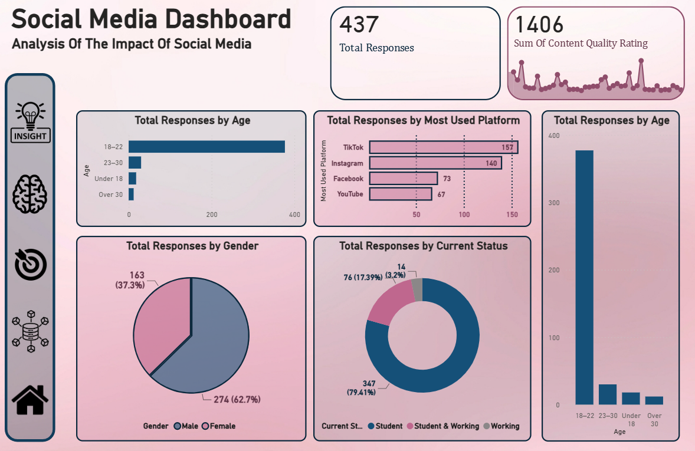
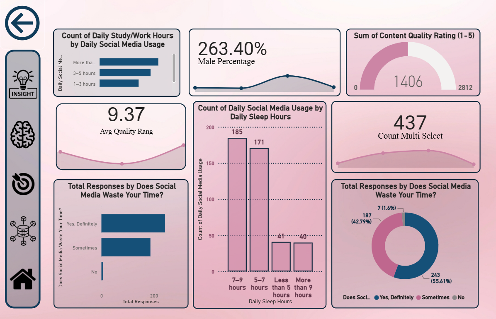
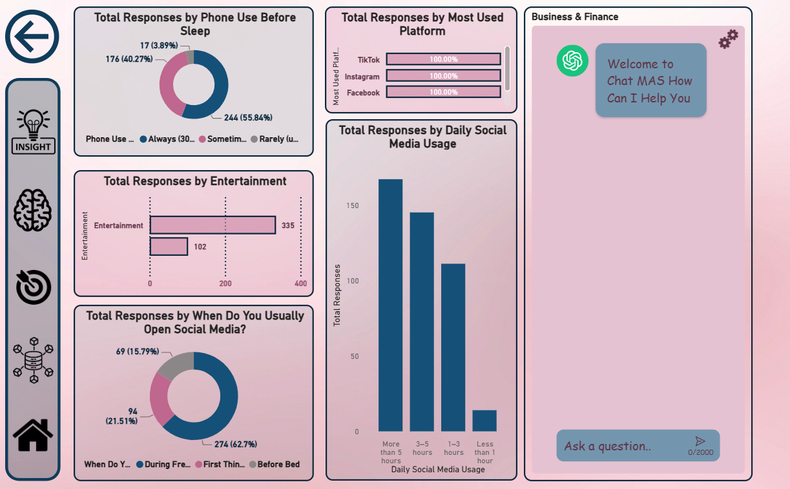
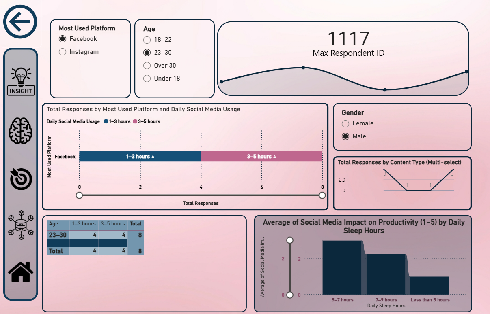
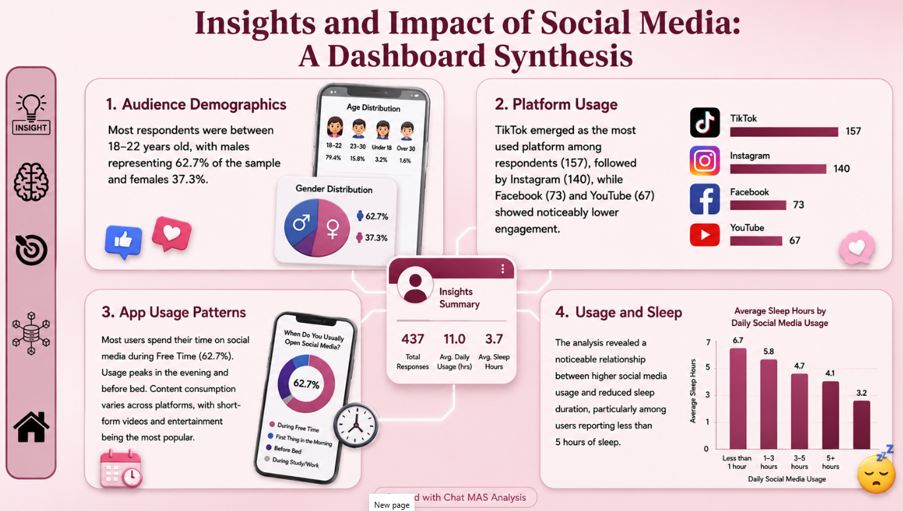

# 📱 Social Media Impact on Productivity & Daily Behavior

A Data Analysis project developed as part of the **Digital Egypt Pioneers Initiative (DEPI)**.

## 📌 Project Overview

This project explores how social media usage affects productivity, sleep quality, daily habits, and overall behavior.

Using survey responses collected from participants, the project analyzes:

- Social media usage patterns
- Most used platforms
- Sleep habits
- Productivity impact
- Demographic distributions
- Content consumption behavior

---

## 🎯 Project Objectives

- Understand social media usage trends.
- Analyze the relationship between social media and productivity.
- Study the impact of screen time on sleep quality.
- Identify the most popular social media platforms.
- Generate actionable insights through interactive dashboards.

---

## 📊 Dataset Information

The dataset contains responses from:

**437 Participants**

Key attributes include:

- Age Group
- Gender
- Employment Status
- Daily Social Media Usage
- Sleep Hours
- Most Used Platform
- Content Type Preferences
- Productivity Impact Rating
- Content Quality Rating

---

## 🛠 Tools & Technologies

- Power BI
- Excel
- Data Cleaning & Transformation
- Data Visualization
- Statistical Analysis

---

# 📈 Dashboard Pages

## 1️⃣ Overview Dashboard

Provides a general overview of the collected responses including:

- Age Distribution
- Gender Distribution
- Employment Status
- Most Used Platforms
- Total Responses



---

## 2️⃣ Usage Behavior Dashboard

Analyzes user habits and daily social media behavior.

Key Insights:

- Most users spend more than 5 hours daily on social media.
- Free time is the most common period for social media usage.
- Entertainment is the dominant content category.



---

## 3️⃣ Productivity & Sleep Analysis

Examines the relationship between:

- Social Media Usage
- Sleep Duration
- Productivity Levels

Key Findings:

- Higher social media usage is associated with lower sleep duration.
- Many participants reported productivity loss due to excessive social media use.




---

## 4️⃣ Interactive Analysis Dashboard

Interactive page allowing users to filter data by:

- Age Group
- Gender
- Platform
- Daily Usage

Used for deeper exploration and custom analysis.



---

## 5️⃣ Executive Summary

A visual summary of the most important findings discovered throughout the analysis.

Highlights:

- TikTok is the most used platform.
- Majority of participants are aged 18–22.
- Social media usage impacts sleep and productivity.
- Entertainment content dominates user preferences.



---

# 🔍 Key Insights

### Demographics

- 79.4% of respondents are students.
- 62.7% are male.
- Most participants belong to the 18–22 age group.

### Platform Usage

- TikTok ranked as the most used platform.
- Instagram followed closely behind.
- Facebook and YouTube showed lower engagement.

### Productivity

- More than half of participants believe social media wastes their time.
- Increased daily usage correlates with reduced productivity.

### Sleep Patterns

- Users with higher screen time generally reported fewer sleep hours.
- Sleep quality tends to decrease as social media usage increases.

---

## 📂 Repository Structure

```text
├── Content_Type.csv
├── DEPI_Prj_FullData.csv
├── Usage_Reasons.csv
├── Project_Dashboard.pbix
├── Project_Document.pdf
├── Project_Presentation.pptx
├── assets/
│   ├── dashboard-overview.png
│   ├── dashboard-usage.png
│   ├── dashboard-analysis.png
│   ├── dashboard-insights.png
│   └── dashboard-summary.png
└── README.md
```

## 👨‍💻 Team

Developed as part of the **DEPI Data Analysis Track**.

### Team Members

| Name | Role |
|------|------|
| Amr Tarek | Team Leader |
| Mahmoud Sallam | Team Member |
| Mazen Ashraf | Team Member |
| Samir Mohamed | Team Member |
| Mohamed Abonar | Team Member |

---

## 📜 Project Deliverables

- Dataset
- Power BI Dashboard
- Project Documentation
- Presentation
- Video Demonstration

---

## ⭐ Conclusion

Social media plays a major role in daily life, especially among young adults. While it provides entertainment and communication benefits, excessive usage shows a noticeable impact on sleep patterns and productivity. This analysis highlights key behavioral trends and provides valuable insights for understanding digital habits.
